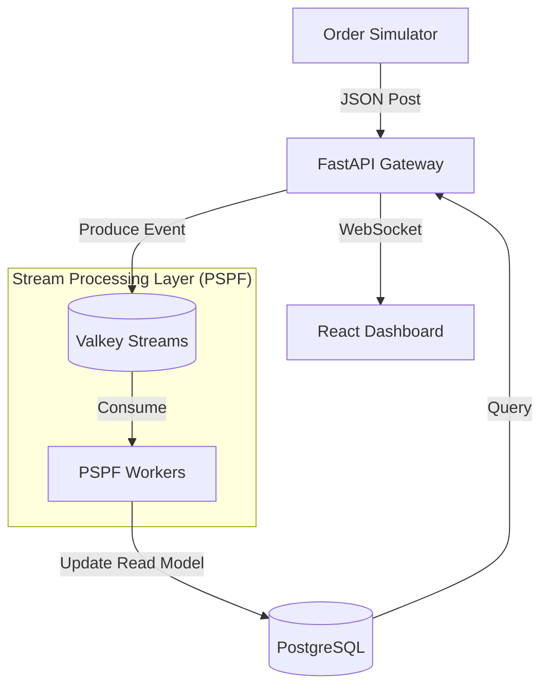

# StreamStock ⚡️

StreamStock is a high-performance, event-driven reference implementation for the **Python Stream Processing Framework (PSPF)**. It demonstrates a scalable inventory management system built with micro-architectural principles, featuring real-time updates and a robust order simulation engine.

## 🏗️ Architecture

StreamStock follows a **Reactive Event-Driven** architecture, leveraging **Event Sourcing** patterns for state consistency and observability.



### Key Components:
- **FastAPI Gateway**: Handles REST API requests and broadcasts real-time updates via WebSockets.
- **PSPF Workers**: Independent processing units that consume events from Valkey Streams, apply business logic, and maintain the PostgreSQL read model.
- **Valkey Streams**: The high-throughput event backbone and persistent message bus.
- **PostgreSQL**: Serving as a high-integrity **Read Model** for complex queries and reporting.
- **Order Simulator**: A load generator that mimics real-world traffic with configurable profiles.

## 🚀 Quick Start

### Prerequisites
- [Docker & Docker Compose](https://docs.docker.com/get-docker/)
- Python 3.11+ (optional, for local development)

### Run the Demo
1. **Launch the entire stack:**
   ```bash
   docker-compose up --build
   ```
2. **Access the Dashboard:**
   Open [http://localhost:5173](http://localhost:5173) in your browser.
3. **Explore the API:**
   Interactive docs are available at [http://localhost:8000/docs](http://localhost:8000/docs).

## 📊 Simulation Profiles
The `simulator` service can be configured via environment variables in `docker-compose.yml`:
- `NORMAL`: Standard traffic (2-5s delay between orders).
- `BURST`: Stress test (0.1-0.5s delay between orders).

## 🛠️ Technical Design Decisions

### Why Valkey Streams?
We chose Valkey (a Redis-compatible fork) for our primary event bus due to its:
- **Low Latency**: Sub-millisecond message delivery.
- **Consumer Groups**: Native support for horizontal scaling and load balancing workers.
- **Persistence**: Reliable stream storage that survives service restarts.

### PostgreSQL as a Read Model
While events are the source of truth in the stream, we use PostgreSQL for the read side (CQRS) because:
- **Relational Integrity**: Essential for inventory management and multi-table joins.
- **Async Efficiency**: PSPF workers update Postgres asynchronously, ensuring the write-path (API) remains extremely fast.

### Alternative State Engines (SQLite vs. RocksDB)
For local state management within PSPF workers, different engines provide distinct trade-offs:
- **SQLite (Current Choice)**:
    - *Pros*: Exceptional SQL tooling, single-file portability, zero-configuration.
    - *Cons*: Write-concurrency is limited compared to LSM-tree based engines.
- **RocksDB (Potential upgrade)**:
    - *Pros*: Optimized for high-frequency writes and SSD performance. Ideal for extremely large local states (millions of keys).
    - *Cons*: More complex configuration, lacks a query language like SQL.

## 📂 Project Structure
- `backend/`: FastAPI application and PSPF Processor logic.
- `frontend/`: React + Vite dashboard.
- `simulator/`: Python-based traffic generator.
- `docs/`: Technical deep dives on pipelines and architecture.

## 🧪 Development
To run the components locally without Docker:
- **Backend**: `pip install -r backend/requirements.txt` then `uvicorn backend.api.main:app`
- **Frontend**: `cd frontend && npm install && npm run dev`
