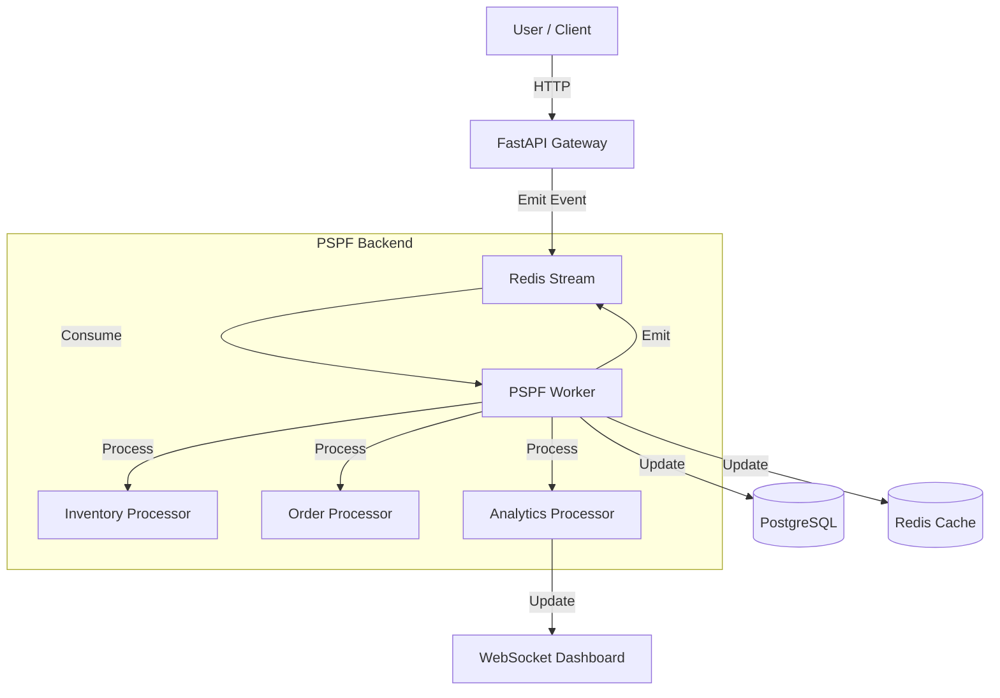

# StreamStock Architecture

StreamStock demonstrates a modern **Event-Driven Architecture** using PSPF.

## High-Level Overview

## Layers

1.  **Ingestion Layer (API)**
    -   **FastAPI** endpoints receive user actions.
    -   Validates input and emits events to the **Event Bus**.
    -   Minimal business logic; mostly "fire and forget" or "write pending state".

2.  **Event Bus (Data Plane)**
    -   **Redis Streams** (via Valkey) acts as the central log.
    -   Events are durable, ordered, and replayable.
    -   Topics: `streamstock.events` (Single stream pattern for global ordering).

3.  **Processing Layer (Compute)**
    -   **PSPF Processors** run in worker nodes.
    -   **InventoryProcessor**: Manages stock levels, reservations.
    -   **OrderProcessor**: Manages order lifecycle (Pending -> Confirmed).
    -   **RestockProcessor**: Reacts to low stock events.
    -   **AnalyticsProcessor**: Aggregates real-time stats.
    -   **AuditProcessor**: Logs everything for compliance.

4.  **State Layer (Storage)**
    -   **PostgreSQL**: System of record (Read Models).
    -   **Redis**: Real-time counters, cache, and steam storage.

## Key Patterns

-   **Event Sourcing Lite**: Current state is derived from events, but we maintain a materialized view (Postgres) for easy querying.
-   **CQRS (Command-Query Responsibility Segregation)**: Not strictly enforced but followed conceptually—Writes go to Stream, Reads come from DB/Cache.
-   **Idempotency**: Processors are designed to handle duplicate event deliveries gracefully.
